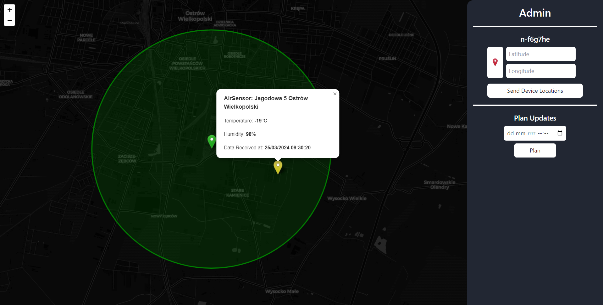

# Brager LoRaWan Network for AirSenso sensor Web Aplication

Aplikacja do zarządzania czujnikami AirSenso [Brager](https://www.brager.pl) company oraz podglądu ich danych.


## Screenshots

#### Desktop




#### Mobile


## Tech Stack

Vue.js, Vite.js, TailwindCSS, Leaflet.js, OpenStreetMaps, SocketIo-client


<br />
<br />

## Run Locally

Clone the project

```bash
  git clone https://github.com/M-MComputerClub/BragerLoRaWanNetwork
```

Go to the project directory

```bash
  cd BragerLoRaWanNetwork
```

Go to the website app directory

```bash
  cd App
```

Install dependencies

```bash
  npm install
```

Run app

```bash
  npm run dev
```

Now go to http://localhost:5173/

Password for the administration panel: **admin**

## Running Tests

To run tests, run the following command

```bash
  npm run test
```

## Authors

- [Mateusz Trzmiel](https://github.com/TRZMlEL)
- [Maciej Matysiak](https://github.com/ItsMaciek)
- [Maksymilian Zwierz](https://github.com/Zwierzu2115)
