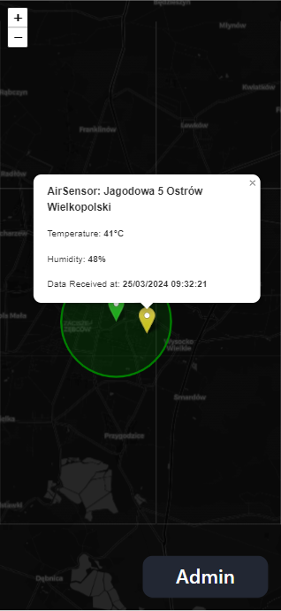

# Brager LoRaWan Network

A brief description of what this project does and who it's for


## Screenshots

#### Desktop


#### Mobile



## Run Locally

Clone the project

```bash
  git clone https://link-to-project
```

Go to the project directory

```bash
  cd my-project
```

Install dependencies

```bash
  npm install
```

Start the server

```bash
  npm run start
```


## Running Tests

To run tests, run the following command

```bash
  npm run test
```


## Authors

- [@octokatherine](https://www.github.com/octokatherine)

